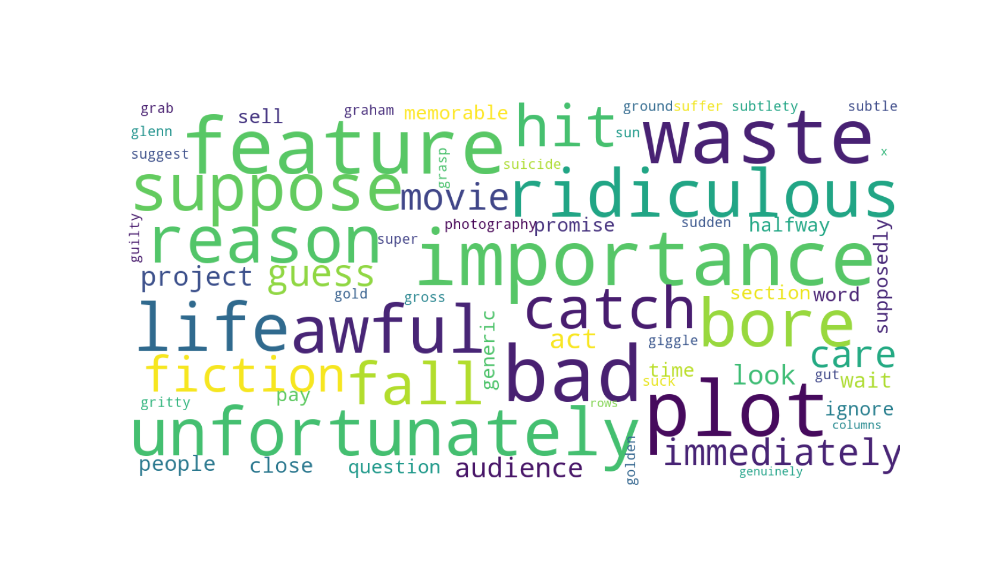

## Sentimental Analysis - NLTK - Natural Language Toolkit and sklearn

> This python code is a sentimental analysis in a dataset of movie reviews. 
> The aim is to define the most relevant words to predict if a review is positive or negative in this particular review dataset.
> Instead of using labeled data we will predict reviews semantic by using Sentiment Intensity Analyzer from NLTK library

- Clean raw text data and perform lemmatization
- NLTK Sentiment Intensity Analyzer to evaluate the semantic of each review (positiveness or negativeness ratio)
- Count Vectorization and TfidfTrasnformer to analyze the context of words across all the documents 
- RandomForestClassifier for supervised learning

**Required libraries**: *nltk, sklearn, wordcloud, numpy, pandas, matplotlib*

