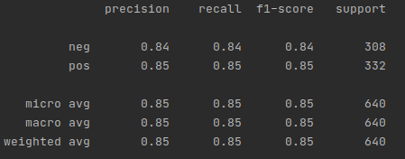

## Predictiing positive or negative reviews

> This python code is a supervised text classification (labeled Data) in a dataset of movie reviews. 
> The aim is to create a prediction model that predicts if review is positive or negative in this particular review dataset.
> Vectorization of each word by applying Count Vectorization and TfidfTrasnformer to understand the  context.

- Clean raw text data 
- Count Vectorization and TfidfTrasnformer to analyze the context of words across all the documents 
- LinearSVC classifier to create predicting model
- Evaluate the predicting model by interpreting confusion matrix, classification report, accuracy, F1-score

**Required libraries**: *sklearn, pandas, matplotlib, os*

